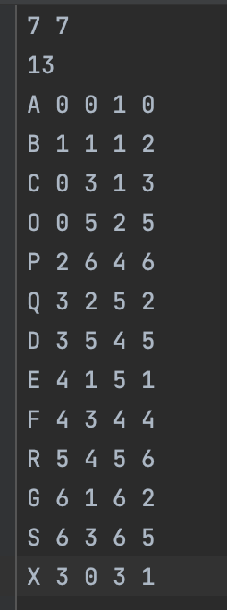
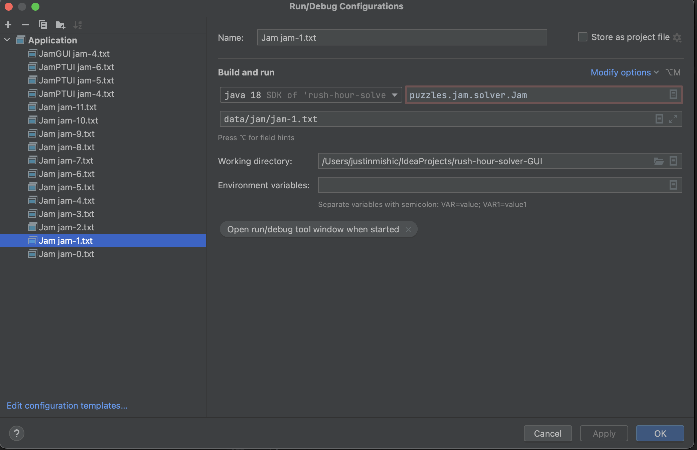
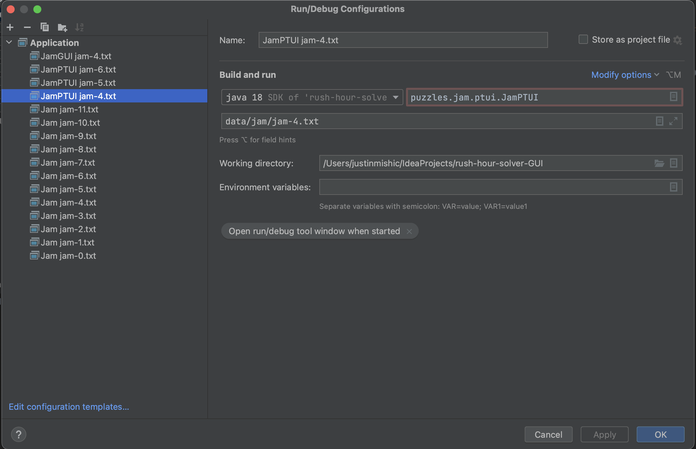
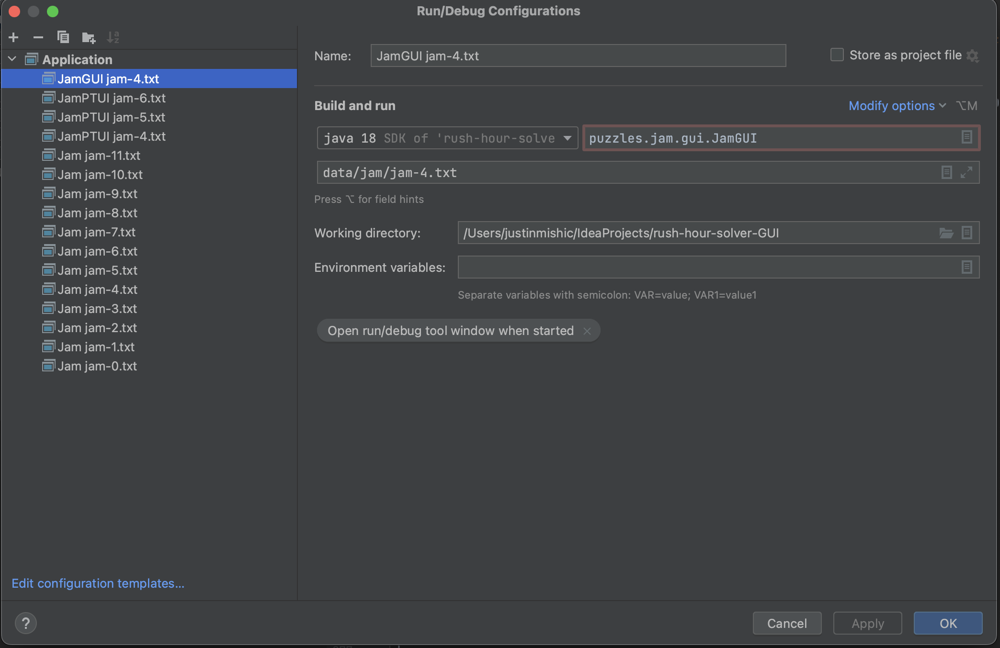

# rush-hour-solver-GUI
Solver for different scenarios of the puzzle game rush hour in Java with basic GUI in JavaFX

## solver algorithm
The Solver is based on a BFS algorithm where the program follows each path until the destination(solution) is reached. The rush hour solver in particular is a variation of this algorithm with backtracking tied in. The rush hour solver uses this backtracking to solve the rush hour puzzle more efficiently.

## text files
The text files are entered in a specific format.
- Each file begins with the size of the puzzle (ex 5 5 for a 5 by 5 square or 7 8 for a 7 by 8 rectangle)
- Next the number of total cars is listed
- Finally all the cars are listed with each represented by a letter 
- Each car has the starting coordinates and ending coordinates (ex A 0 1 0 3)
- The main 2 by 1 car we are solving for is always represented by 'X' and is last in the file

### text file example

## run configurations
Run configurations for running different text files representing different rush hour puzzles

### solver for a textfile puzzle

### text user interface configuration

### GUI configuration

